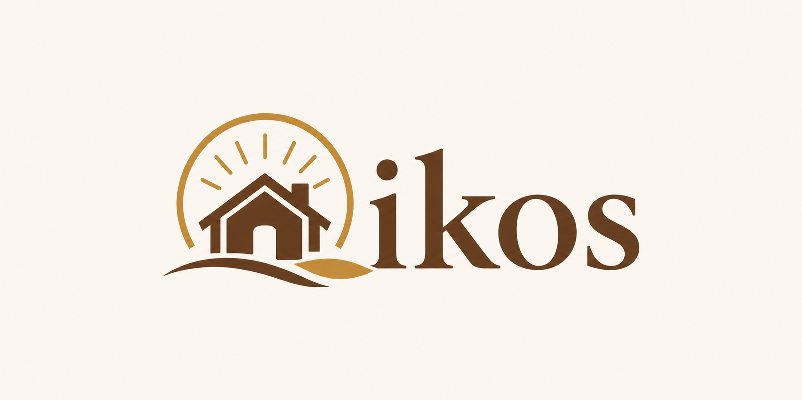

# Oikos — Brand Guidelines
### Documento Interno de Identidade de Marca

---

## 1. Essência da Marca

**Nome:** Oikos
**Origem:** Do grego οἶκος — casa, lar, família, comunidade doméstica.
**Slogan:** *Where Faith Finds Home*

Oikos não é um aplicativo de produtividade. É um lar digital para comunidades de fé.
A plataforma existe para transformar a prática espiritual individual em responsabilidade coletiva — onde o crescimento de um edifica o todo.

---

## 2. Propósito e Posicionamento

**O problema que resolvemos:**
O mercado de habit trackers é hiper-individualista. A fé, ao contrário, é essencialmente comunitária.

**Nossa crença:**
Hábitos espirituais não são tarefas em uma checklist — são atos de devoção e comunhão. O Oikos transfere a métrica de sucesso do *eu* para o *nós*.

**Para quem somos:**
Grupos religiosos de múltiplas tradições — católicos, evangélicos, protestantes e outros — que buscam crescer juntos de forma organizada e motivadora.

**O que nos diferencia:**
Accountability mútua e fraterna, enraizada na cultura das instituições religiosas. Não competição — edificação.

---

## 3. Personalidade da Marca

| Atributo | Descrição |
|---|---|
| Acolhedor | Recebe qualquer tradição, qualquer pessoa |
| Solene | Respeita a profundidade da fé |
| Caloroso | Humano, não corporativo |
| Comunitário | O grupo sempre maior que o indivíduo |
| Confiável | Discreto, consistente, seguro |

**O que Oikos NÃO é:**
- Frio ou tecnológico demais
- Exclusivo de uma denominação
- Gamificado de forma competitiva ou agressiva
- Corporativo ou voltado a produtividade

---

## 4. Logo



**Símbolo:** Casa estilizada dentro de um círculo solar radiante, com ondas de terra abaixo — representando enraizamento, luz e acolhimento.

**Tipografia do logo:** Serifada clássica, peso bold, transmitindo tradição e solidez.

**Elementos e seu significado:**

| Elemento | Significado |
|---|---|
| Casa | O lar — lar da fé, da comunidade, do grupo |
| Círculo solar | Luz divina, transcendência, plenitude |
| Raios | Irradiação — a fé que se expande pela comunidade |
| Ondas de terra | Enraizamento, fundação, permanência |
| Tipografia serifada | Tradição, solenidade, confiança |

**Uso do logo:**
- Sempre sobre fundo claro (`#F7F3EE` ou branco)
- Nunca distorcer proporções
- Manter espaço de respiro ao redor do símbolo equivalente à altura da letra "O"
- Não aplicar sobre fundos escuros ou coloridos

---

## 5. Paleta de Cores

| Nome | Hex | Uso |
|---|---|---|
| Off-white quente | `#F7F3EE` | Fundo principal da aplicação |
| Marrom primário | `#6B3A1F` | Textos, títulos, elementos principais |
| Dourado accent | `#C49A2B` | Botões de ação, destaques, bordas ativas |
| Dourado claro | `#D4A843` | Elementos secundários, ícones, detalhes |
| Cinza quente | `#A89880` | Textos secundários, placeholders |

**Hierarquia de uso:**
1. Fundo sempre em `#F7F3EE`
2. Conteúdo principal em `#6B3A1F`
3. Ações e destaques em `#C49A2B`
4. Detalhes e suporte em `#D4A843` e `#A89880`

---

## 6. Tipografia

| Uso | Fonte | Estilo |
|---|---|---|
| Logo e títulos principais | Playfair Display | Bold, serifada |
| Subtítulos e destaques | Playfair Display | Regular |
| Corpo de texto e interface | Lato ou Inter | Regular / Medium |

**Importação Google Fonts:**
```
Playfair Display: 400, 700
Lato: 400, 500, 700
```

---

## 7. Tom de Voz

**Como Oikos fala:**
- Em primeira pessoa do plural — *"nosso grupo", "nossa meta", "conquistamos"*
- Com encorajamento, nunca cobrança
- Simples e direto, sem jargão técnico
- Com respeito à diversidade de tradições — sem linguagem exclusiva de uma denominação

**Exemplos de mensagens:**
- ✅ "Seu grupo bateu a meta! Que conquista."
- ✅ "Registre a atividade de hoje e fortaleça sua comunidade."
- ❌ "Você atrasou 3 dias. Recupere seu streak."
- ❌ "Maximize sua produtividade espiritual."

---

*Oikos — Where Faith Finds Home*

